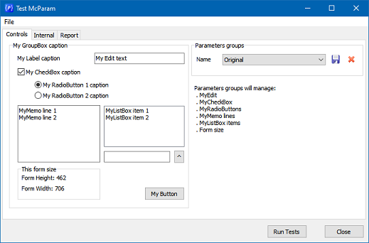

# McParam
A **Delphi / Lazarus / C++Builder** simple class to manage parameters persistence.

 


## Motivation
* Simple Object-Pascal native code.
* Just one unit (`McParam`), just one class(`TMcParam`).
* Not a visual component; just an unit and simple class.
* Compatible (aimed):
   * Delphi 7 up to now.
   * Lazarus.
   * C++Builder 2006 up to now.
* Tested with:
   * Delphi 12 (CE)
   * Lazarus 2.3.0 (FPC 3.2.2)
   * C++Builder 10.2 (Pro)

## Quick Start
Objects of the `TMcParam` class organize parameters into groups.

````Pascal
uses McParam;
...
var
  prm: TMcParam;
...
prm := TMcParam.Create('');
prm.CreateGroup('group-1');
````  

To insert parameters, use the `Items` property.
````Pascal
var
  prm: TMcParam;
...
prm := TMcParam.Create('');
prm.CreateGroup('group-1');
prm.Items.S['s1'] := 'v1';
prm.Items.I['i1'] := 1;
````  

Parameters are read or written using keys and values. You can specify the value type using the Items properties. See `TMcJSON` for more.
* `S[]`: string
* `I[]`: interger
* `D[]`: double
* `B[]`: boolean
* `N[]`: null

Internally, groups and parameters are stored using JSON.
````Json
{
  "Groups": [
    {
      "group-1": {
        "s1": "v1",
        "i1": 1
      }
    }
  ],
  "Selected": "group-1"
}
````

When a group is created, it is automatically selected. If you have two or more groups, you can select a specific one.
````Pascal
var
  prm: TMcParam;
...
prm := TMcParam.Create('');
prm.CreateGroup('group-1');
prm.CreateGroup('group-2'); // selected
// select group-1.
prm.Selected := 'group-1';
// or select group-2 using a different way.
prm.GetGroup('group-2');
````  

*Important*: When a group is selected, the `Items` property references the parameters of that group.

When the time is right, you can save the parameters to a file.
````Pascal
fileName := 'params.json';
prm.SaveToFile(fileName);
````

Similarly, the file with parameter groups can be read from a file.
````Pascal
fileName := 'params.json';
prm.LoadFromFile(fileName);
if ( prm.ExistsGroup('group-1') ) then
  prm.GetGroup('group-1');
````


## Controls Parameters
The `TMcParam` class has a facilitator for reading or writing properties associated with existing controls in Delphi and C++Builder. This feature uses classic `Delphi RTTI` methods for language reflexion.

For example, to *set* the value of the `Text` property *from* a `TEdit` object, you could do the following:

````Pascal
// set params from control properties: from Control.Property to Items.
prm.SetFrom(MyEdit, 'Text');
````

Internally, the JSON structure will look like this:

````Json
{
  "Groups": [
    {
      "comps": {
        "MyEdit.Text": "My Edit text"
      }
    }
  ],
  "Selected": "comps"
}
````

Conversely, to *get* the `Text` property *to* change a `TEdit` object, you can do:
````Pascal
// get params to control properties: from Items to Control.Property.
prm.GetTo(MyEdit, 'Text', 'Some default text here');
````
Note that the `GetTo()` method allows you to specify a default value if the property does not exist.

## Frame `ParamGroups`
To demonstrate the use of `TMcParam` and also assist users in managing parameter groups, the `TFrameParamGroups` class exists in the code.

For example, you can create this frame inside a TGroupBox and configure two events to Save and Load parameters.

````Pascal
uses FrParamGroups;
...
const C_PARAMS_GROUPS_FILE = 'ParamsGroups.json';
...
// create parameters groups manager.
FFrameParamGroups := TFrameParamGroups.Create(self, C_PARAMS_GROUPS_FILE);
FFrameParamGroups.Parent := GbxParamGroups;
FFrameParamGroups.Align  := alTop;
FFrameParamGroups.OnSave := ParamGroupsSave;
FFrameParamGroups.OnLoad := ParamGroupsLoad;
````

Events can describe which parameters will be read and written, remembering that the frame contains a `McParam` property that can be accessed by the user.

````Pascal
procedure TFormMain.ParamGroupsSave(Sender: TObject);
var
  frame: TFrameParamGroups;
begin
  frame := (Sender as TFrameParamGroups);
  if ( Assigned(frame) ) then
  begin
    frame.McParam.SetFrom(MyEdit       , 'Text'   );
    frame.McParam.SetFrom(MyCheckBox   , 'Checked');
    frame.McParam.SetFrom(MyRadioButton, 'Checked');
	frame.McParam.SetFrom(self         , 'Height' );
    frame.McParam.SetFrom(self         , 'Width'  );
    // example with the usual set param.
    frame.McParam.Items.S['MyMemo.Lines.Text'] := McJsonEscapeString(MyMemo.Lines.Text);
  end;
end;

procedure TFormMain.ParamGroupsLoad(Sender: TObject);
var
  frame: TFrameParamGroups;
begin
  frame := (Sender as TFrameParamGroups);
  if ( Assigned(frame) ) then
  begin
    frame.McParam.GetTo(MyEdit       , 'Text'   , 'Some text here...');
    frame.McParam.GetTo(MyCheckBox   , 'Checked', True               );
    frame.McParam.GetTo(MyRadioButton, 'Checked', True               );
    frame.McParam.GetTo(self         , 'Height' , 462                );
    frame.McParam.GetTo(self         , 'Width'  , 726                );
    // example with the usual set param.
    MyMemo.Lines.Text := McJsonUnEscapeString(frame.McParam.Items.S['MyMemo.Lines.Text']);
  end;
end;
````
